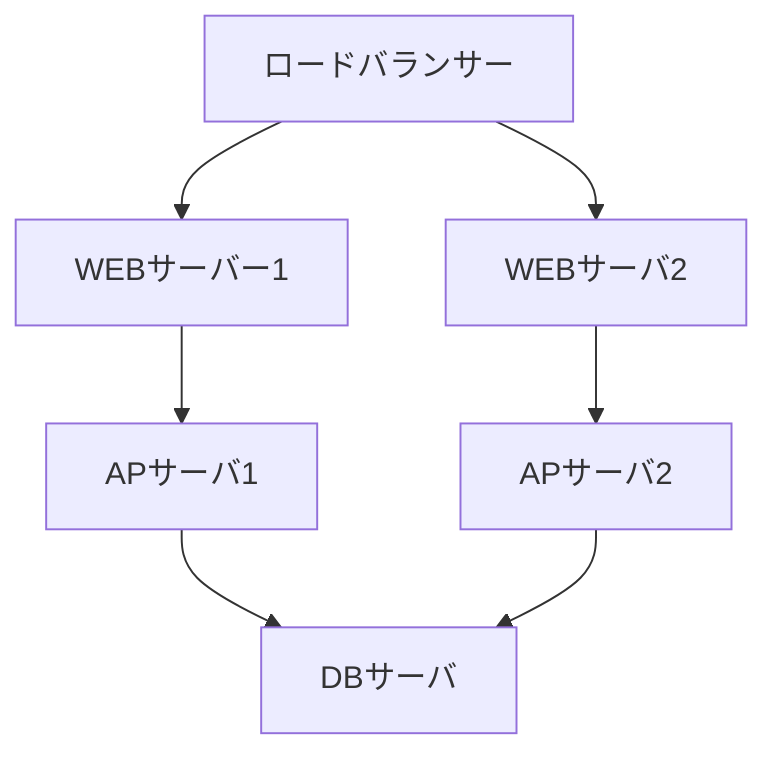

Github Pagesでmermaidを利用する方法を記載します。

結構表現力があるので、設計書やシステム構成図などこれで書いていけば
Excelや画像などと違って差分を見られて便利な気がしています。

```
graph TD
    LB[ロードバランサー] --> WS1[WEBサーバー1]
    LB --> WS2[WEBサーバ2]
    WS1 --> AP1[APサーバ1]
    WS2 --> AP2[APサーバ2]    
    AP1 --> DB[DBサーバ]
    AP2 --> DB
```
上記を記載することで以下のように表示されます。



方法としては、以下を.mdのファイルの末尾に記載しています。
```Javascript
<script src="https://cdnjs.cloudflare.com/ajax/libs/mermaid/8.0.0/mermaid.min.js"></script>
<script>
   mermaid.initialize({
       startOnLoad:true,
       theme: 'default'
   });
   window.mermaid.init(undefined, document.querySelectorAll('.language-mermaid'));
</script>
```

<script src="https://cdnjs.cloudflare.com/ajax/libs/mermaid/8.0.0/mermaid.min.js"></script>
<script>
   mermaid.initialize({
       startOnLoad:true,
       theme: 'default'
   });
   window.mermaid.init(undefined, document.querySelectorAll('.language-mermaid'));
</script>